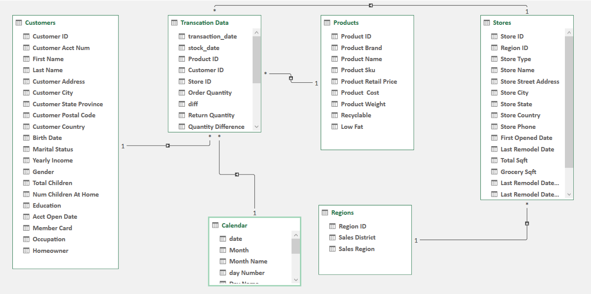

#Maven Market Dashbaord Report

## Created by - Muzamil Channa @ Aspiring Data Analyst [Linkedin Profile](https://www.linkedin.com/in/muzamil-channa-a2216a175/)

## Table of Contents

1. [Introduction](#introduction)
2. [Project Overview](#project-overview)
3. [Business Problem](#business-problem)
4. [Workflow Steps](#workflow-steps)
5. [Key Insights for Maven Market in 1998 (USA FOCUS)](#key-insights-for-maven-market-in-1998-usa-focus)
    - [Revenue and Profit](#revenue-and-profit)
    - [Transactions](#transactions)
    - [Seasonal Trends](#seasonal-trends)
    - [Product Analysis](#product-analysis)
    - [Store Analysis](#store-analysis)
    - [Overall](#overall)

<table>
  <tr>
    <td align="center"></td>
    <td align="center"></td>
  </tr>
</table>

<table style="border-collapse: separate; border-spacing: 20px;">
  <tr>
    <td align="center"></td>
    <td align="center"></td>
  </tr>
  <tr>
    <td align="center">Model Image</td>
    <td align="center">Table Information Image</td>
  </tr>
</table>

## Introduction

Maven Market, a multi-national grocery chain located in Canada, Mexico, and the United States, aims to increase overall profitability in the USA across all store types by understanding customer demographics, product performance, and store profitability variations.

## Project Overview

Maven Market experienced revenue growth in 1999 compared to 1998; however, significant profitability variations across store types, product categories, and customer segments exist. Identifying underlying reasons for these variations and capitalizing on successful strategies is crucial for future growth and profit maximization.

## Business Problem

While revenue increased in 1998 compared to 1997, profitability remains varied across store types and product categories. Understanding these variations and identifying profitable strategies are essential for sustained growth.

## Workflow Steps

1. Connecting and shaping the source data
2. Building a relational model
3. Adding calculated columns and measures
4. Designing an interactive report

## Key Insights for Maven Market in 1998 (USA FOCUS)

### Revenue and Profit:

- Overall revenue increased significantly (56%) compared to 1997.
- Profit saw a slight increase (0.02%) compared to 1997.
- Supermarkets are the clear leader in terms of both revenue and profit.

### Transactions:

- The total number of transactions increased substantially (36%) compared to 1997.
- Supermarkets again lead with the most transactions.
- However, the average transaction value for Supermarkets is higher than other store types, suggesting they might attract customers making fewer but larger purchases.

### Seasonal Trends:

- Revenue seems to be slightly higher in Q4 (holiday season).

### Product Analysis:

- There is some brand overlap across different store types, but some unique top performers exist for each. This suggests potential for targeted promotions.

### Store Analysis:

- Profitability varies within each store type, indicating room for improvement in underperforming stores.

### Overall:

- Supermarkets are driving force behind Maven Market's revenue and profit.
- Transaction numbers are increasing, but there's a need to understand customer buying behavior better.
- Focus on optimizing underperforming stores and potentially personalizing promotions based on product popularity in each store type.
- Invest in gathering consistent data across international markets to enable better comparisons.

#
#### Don't forget to give a star to this project because it motivates me, and please follow me on [LinkedIn](https://www.linkedin.com/in/muzamil-channa-a2216a175/). Also, please consider me for any internship or entry-level data analyst role. I need a job or internship even though it's free or paid. Thanks in Advance.

- Created & Presented by – Muzamil Channa @ Aspiring Data Analyst
- Date: 26/04/2024
- Place: Pakistan, Karachi

